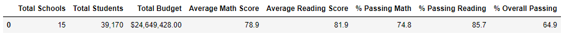

# school-district-analysis

## Project Overview
The purpose of this analysis is to prepare standardized test data for analysis, reporting, and presentation. In doing so, we may provide insights about performance trends and patterns. The insights are useful at the school and district level in determining how to restructure schools such that they all perform their best, and all of them generally perform as well as all the others. We particularly analyzed schools' test scores and how they vary depending on indiviudal schools' funding, school sizes, and types of schools (between charter and district public schools). Our analysis assists the district superintendent and the school board in making decisions regarding the school budget's priorities.

## Resources
- Data Sources: schools_complete.csv, students_complete.csv
- Software: Python 3.8.8, Jupyter Notebook : 6.3.0,Visual Studio Code, 1.60.2

## Results
The district summary is affected by: 
-Total Schools
-Total Students
-Total Budget
All of these measurements can be located within the listed Data Sources from above. From these values, we could produce:
-Average Math Score
-Average Reading Score
-% Passing Math
-% Passing Reading
-% Overall Passing
This DataFrame presents all of the above information in seperate columns. It is meant to give a rundown of how the school district breaks down in each individual measure. It is an over-arching idea of the information we want to delve into further. We delve in further by looking at each school, individually.

The school summary is affected by:
-School Type	
-Total Students
-School Budget	
Similarly, all of these measurements were procured from the Data Sources that I listed above. From these values, I was able to produce:
-Per Student Budget
-Average Math Score	
-Average Reading Score	
-% Passing Math	
-% Passing Reading	
-% Overall Passing
This DataFrame allows us to see how each school performs on their own, but they are situated all together in one single data frame. Thus, we can more easily visualize and compare how different schools perform differently from one another.

A major shake-up along the way in producing this complete analysis was when we learned that the ninth graders as Thomas High School were under suspicion of academic dishonesty. As such, we needed to nullify their data in our analysis. After we did this, it's apparent that many students attempted to cheat, though the "cheat sheet" was actually botched - it brought the school's average math *and* reading grades down to 66.91% and 69.66%, respectively. Overall, 65.07% of students at Thomas High School were passing.

Once we removed the ninth graders' grades from the data, we can see a silver lining in the chaos: the average school grades improved! Looking at only the 10th through 12th grades from Thomas High, we can see that 93.19% passed math, 97.0% passed reading, and overall, 90.63% of students passed! In removing the troublesome data, we can see a much clearer picture of how grades broke down for the school. It looks good against all the other schools in the district.

In replacing the ninth-grade scores:
- The math and reading scores by grade remain unchanged for all schools and grades -- aside from the ninth graders at Thomas High School. Everything else, all the other respective data for each school and each grade, remains as it were from before our removal of the sour data.
- The scores by school spending show that the scores improved for schools in the $630-$644 range. All other ranges remained unchanged.
- The scores by school size remained unchanged, all except for the Medium Range (1000-2000 students), of which Thomas High School fell into. Because their overall scores improved, this range also improved.
- The scores by school type changed, specifically for charter schools. Thomas High School is a charter school. The district public schools' perfomance did not change at all after the bad data was dealt with.

## Summary
After the ninth-graders math and reading scores were replaced with NaNs in our DataFrames, a number of changes occured:

1. The average passing percentage of students in reading and math for Thomas High School increased by 26.81%. This is because a lot of ninth graders apparently cheated, and their source material was off - they ended up failing harder in total than they would have otherwise, without following corrupted cheating!
2. The overall passing percentage for Thomas High School was recorded as 90.63%, much higher from the far worse 65.07% it had to display before the bad data was removed.
3. The number of total students in the school district used to measure average scores decreased once bad data was removed. In effect, this caused each remaining students' grades to carry more weight in determining averages across math, reading, and overall passing percentages.
4. Thomas High School was no longer listed in the bottom five performing schools. They are more appropriately reflected in our analysis.